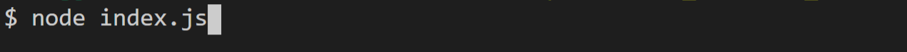
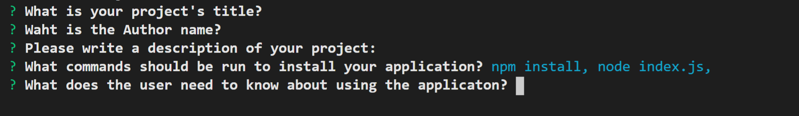
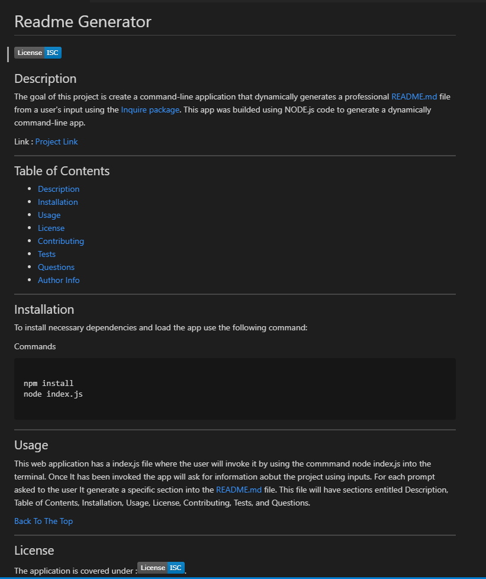

# Professional README Generator


Link : [Project](https://github.com/CesarAugustoMartinez/README_Generator)\
Link : [Video](https://github.com/CesarAugustoMartinez/video.html)

---

### Table of Contents

- [Description](#description)
- [How to Use](#how-to-use)
- [Screenshots](#screenshots)
- [References](#references)
- [License](#license)
- [Author Info](#author-info)

---

## Description

The goal of this project is create a command-line application that dynamically generates a professional README.md file from a user's input using the [Inquire package](https://www.npmjs.com/package/inquirer). This app was builded using NODE.js code to generate a dynamically command-line app. 

##### Technologies

- JavaScript
- jQuery
- Visual Studio Code
- Node.js
- Package.json

##### Code sample - JavaScript
#

```js
function writeToFile(fileName, data) {
    return fs.writeFileSync(fileName,data);

}


// function to initialize program
function init() {
    inquirer.prompt(questions)
    .then(function(response){
        writeToFile("README.md",generateReadme(response));
    })
    .catch(function(err){
        console.log(err);
    })

}

```
##### Code sample - package.json
#
```json
 {
  "name": "readme_generator",
  "version": "1.0.0",
  "description": "Package for readme generator",
  "main": "index.js",
  "scripts": {
    "test": "echo \"Error: no test specified\" && exit 1"
  },
  "repository": {
    "type": "git",
    "url": "git+https://github.com/CesarAugustoMartinez/README_Generator.git"
  },
  "author": "Cesar A Martinez",
  "license": "ISC",
  "bugs": {
    "url": "https://github.com/CesarAugustoMartinez/README_Generator/issues"
  },
  "homepage": "https://github.com/CesarAugustoMartinez/README_Generator#readme",
  "dependencies": {
    "inquirer": "^7.3.3"
  }

```
---

## How To Use

This web application has a index.js file where the user will invoke it by using the commmand node index.js into the terminal. Once It has been invoked the app will ask for information aobut the project using inputs. For each prompt asked to the user It generate a specific section into the README.md file. This file will have sections entitled Description, Table of Contents, Installation, Usage, License, Contributing, Tests, and Questions.
 
## Screenshots

- Command to run the app



- Simple Inputs 



- Input with choices


- README file generated - sample



[Back To The Top](#Weather-Dashboard)

---

## References

- w3school -- [Node.js NPM](https://www.w3schools.com/nodejs/nodejs_npm.asp)
- NPM -- [Node Package Managment](https://www.npmjs.com/)
- Node.js -- [About Node.js](https://nodejs.org/en/)
- Node.js -- [The package.json guide](https://nodejs.dev/learn/the-package-json-guide)


[Back To The Top](#Professional-README-Generator)

---

## License

Copyright (c) [2020] [Cesar A Martinez]

[Back To The Top](#Professional-README-Generator)

---

## Author Info

- Twitter -- [@cesaguma](https://twitter.com/cesaguma)
- Linkedin -- [Cesar A Martinez](https://www.linkedin.com/in/cesar-augusto-martinez-auquilla-03934a16b/)
- GitHub -- [CesarAugustoMartinez](https://github.com/CesarAugustoMartinez)

[Back To The Top](#Professional-README-Generator)
